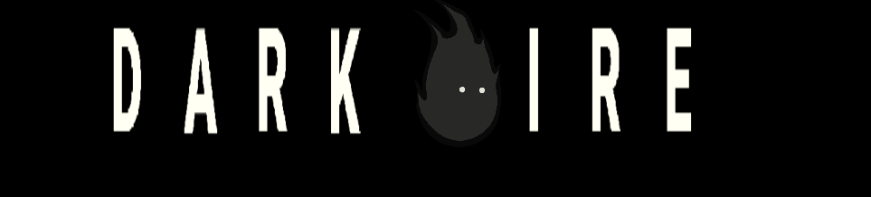
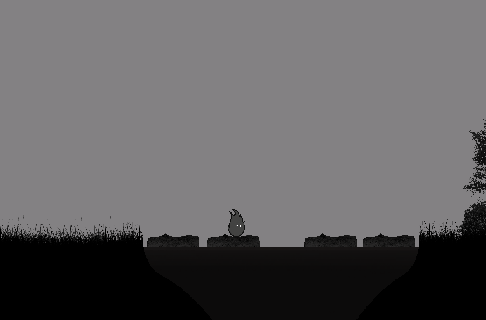
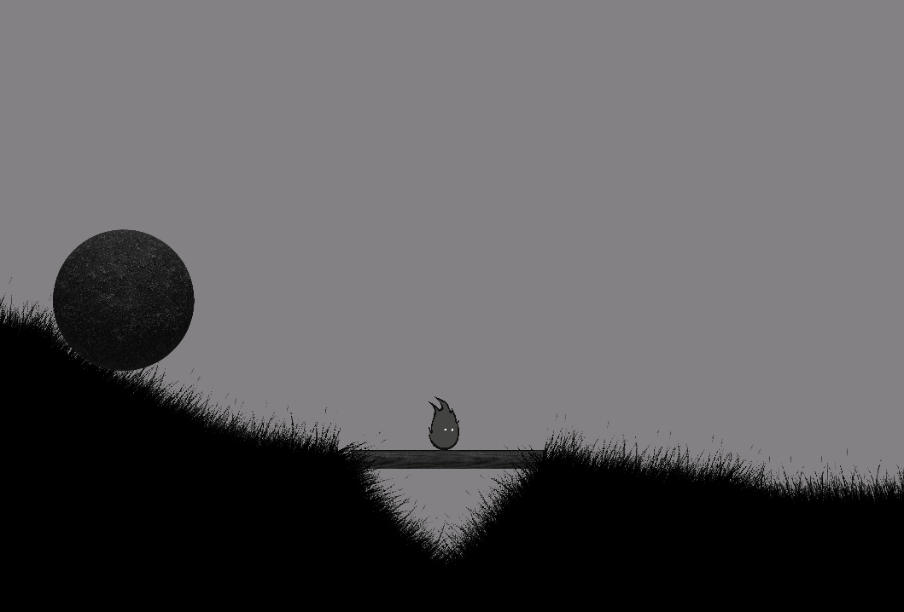

# Voice control game

___
2D платформер с голосовым управлением. 

Главным героем является огонек, который сталкивается с препятствиями на своем пути.
___

## О проекте 

На разработку данного проекта подтолкнуло любопытсво, каким образом работают такие игры как One Hand Clapping, YASUHATI и им подобные. 

Было интересно создать что-то нестандарное. Идея не нова, но я редко сталкивался с подобным.

### При разработке научился: 
+ Работать с библиотекой UnityEngine.Windows.Speech и его классом KeywordRecognizer. 
+ Узнал каким образом можно открыть доступ Unity к микрофону

___

## Основной геймплей 

+ Управление персонажем контролируется голосом:
  + Вперед - Go;
  + Назад - Back; 
  + Остановиться - Stop;
  + Прыжок - Jump;
  + Атака - Fire; 

+ При попадании в воду игрок погибает;

  
+ На пути встречаются препятствия, главному герою необходимо искать способы обойти их;

+ Имеются дополнительные платформы, которые также реагируют на голос игрока;
___

## Что бы хотел изменить, если бы делал данный проект на сегодняшний день:

+ Проект находится на стадии разработки;
